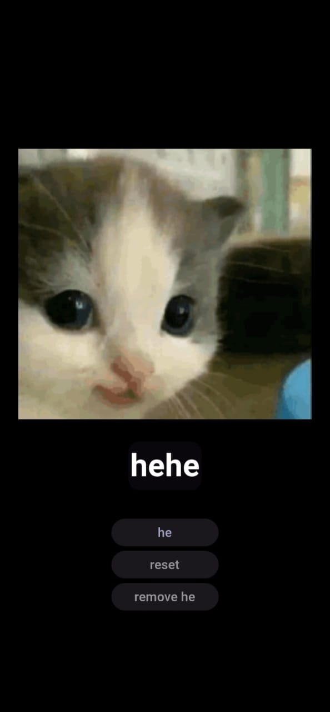
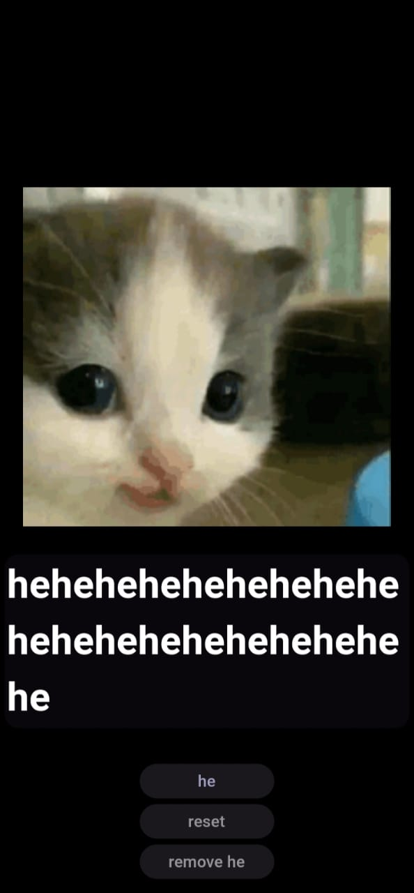

# hehegenerator

Welcome to this Flutter App! This is a simple Flutter app that demonstrates cats and hehes'

The opening screen

a little 'he'

a little more

and MORE

# Three buttons for functionality

1.he : to add a "he"
2.reset : to reset to original "hehe"
3.remove he : to remove a "he" 

To download and run the app (for whatever reason🫶🏽
)

1.Install Flutter! [official Flutter website](https://flutter.dev/docs/get-started/install) 

2.Clone the Repository
`git clone https://github.com/antresssss/hehe-generator.git`

3.Navigate to the project directory , install dependencies ,run the app,and start generating 👩🏽‍🎤

To download an apk : run the command `flutter build apk`

      ********************************************************

👩🏼‍💻 pls add anything more if you can,all welcome,fork,change,pull request (fancy word-contribute)

NOTE : This is just a fun project 👩🏼‍🎨. I like cats , I like hehes' so combine them 👩🏼‍🔬 

